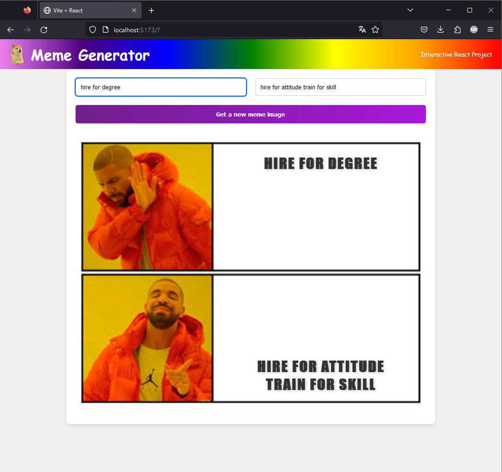

# Meme Generator with React

## Description

This project is an interactive Webapp, built using React. It allows users to fetch Meme templates through API and add text onto it which allows users to generate a custom Meme.

Try it out: https://react-meme-generator-telmen.netlify.app/

## Table of Contents

- [Installation](#installation)
- [Usage](#usage)
- [Features](#features)
- [Technologies Used](#technologies-used)

## Installation

1. Clone the repository:
   git clone https://github.com/VanqCoding/REACT_meme-generator.git

2. Navigate to the project directory:
   cd react_meme-generator

3. Install dependencies:
   npm install

## Usage

1. Start the development server:
   npm start

2. Open your browser and visit http://localhost:3000 to view the application.

## Features

- **Explore Meme Templates:** Browse and discover a variety of meme templates and generate your own custom Meme.

## Technologies Used

- React
- HTML/CSS/JavaScript
- Vite
- API
